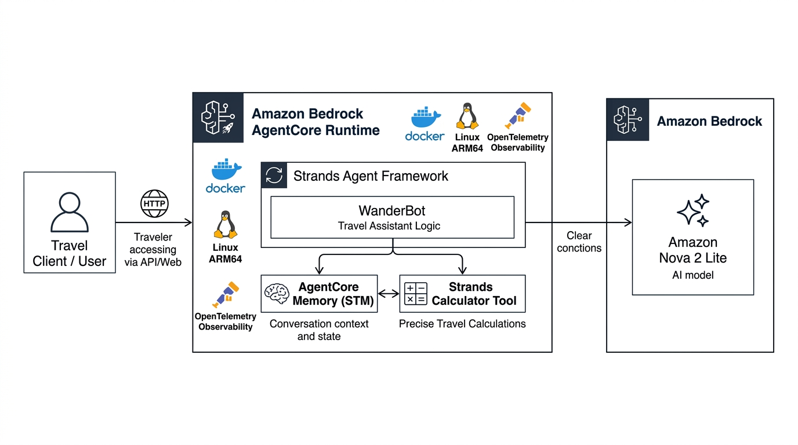

# WanderBot Agent

[](https://www.python.org/)
[](https://aws.amazon.com/bedrock/)
[](https://aws.amazon.com/bedrock/)
[](https://github.com/)
[](https://www.docker.com/)
[](https://opentelemetry.io/)

WanderBot is the official AI travel assistant for Horizon Travel, built on top of the AWS Bedrock AgentCore serverless container runtime and the Strands Agents framework.

WanderBot helps travelers explore destinations, organize itineraries, and calculate trip budgets, flight point conversions, and journey durations with high precision.

---

## System Architecture



### Architecture Flow

1. **Traveler / Client**: Sends user prompts (such as questions about trip itineraries, point redemption, and cost estimates) to WanderBot over HTTP.
2. **Bedrock AgentCore Runtime**: Serves as the host runtime inside a lightweight Docker container (Linux ARM64). It provides built-in OpenTelemetry distributed tracing and metrics.
3. **Strands Agent Framework**: Runs the WanderBot core agent logic with specialized travel prompts and behavioral guardrails.
4. **Strands Calculator Tool**: Whenever numbers, point conversions, multi-city travel budgets, or duration calculations are requested, WanderBot offloads computation directly to the calculator tool to prevent LLM hallucinations.
5. **AgentCore Memory (STM)**: Persists short-term conversation context across multi-turn interactions so travelers can have natural back-and-forth planning sessions.
6. **Amazon Bedrock (Nova 2 Lite)**: Powers the agent's natural language comprehension, travel reasoning, and response generation with low latency and cost efficiency.

---

## Key Features

- **Travel Intelligence**: Tailored system prompts designed specifically for Horizon Travel's vacation planning and recommendations.
- **Accurate Calculations**: Uses `strands_tools.calculator` for all numeric calculations (budgets, split costs, point conversions, discounts).
- **Stateful Conversations**: Backed by Bedrock AgentCore Short-Term Memory (STM) with 30-day event retention.
- **Serverless Containerized Deployment**: Packaged for Linux ARM64 with UV fast dependency management.
- **Production-Ready Observability**: Pre-configured with the AWS OpenTelemetry Distro (`aws-opentelemetry-distro`) for distributed request tracing and monitoring.

---

## Project Structure

```text
wanderbot/
├── .bedrock_agentcore/                  # Bedrock AgentCore container assets
│   └── wanderbot/
│       └── Dockerfile                   # Multi-stage UV-powered container definition
├── assets/
│   └── architecture-diagram.jpg         # Enterprise system architecture diagram
├── .bedrock_agentcore.yaml.example      # Sanitized AgentCore configuration template
├── .dockerignore                        # Docker build context exclusions
├── .gitignore                           # Git ignore rules (virtualenvs, cache, logs)
├── requirements.txt                     # Core dependencies (strands, agentcore, uv)
├── starter.py                           # Application entrypoint & Agent definition
└── README.md                            # Project documentation
```

---

## Getting Started

### Prerequisites

- Python 3.10+ (Python 3.13 recommended)
- AWS CLI configured with appropriate permissions for Amazon Bedrock and AgentCore
- Docker (optional, for local container testing)
- uv (recommended for ultra-fast dependency management)

### 1. Clone the Repository

```bash
git clone https://github.com/dilukshashamal/wanderbot-agent.git
cd wanderbot-agent
```

### 2. Set Up Virtual Environment

```bash
# Using standard Python venv
python -m venv venv

# Activate on Windows:
venv\Scripts\activate

# Activate on Linux/macOS:
source venv/bin/activate
```

### 3. Install Dependencies

```bash
pip install -r requirements.txt
```

### 4. Configure AWS Credentials

Ensure your environment has access to Bedrock in `us-east-1` (or your target region):

```bash
aws configure
# or export environment variables:
export AWS_REGION=us-east-1
export AWS_DEFAULT_REGION=us-east-1
```

### 5. Run the Agent Locally

```bash
python starter.py
```

The `BedrockAgentCoreApp` server will start and listen on port `8080` (or `9000` / `8000` depending on your AgentCore configuration).

---

## Testing the Agent

You can invoke the agent endpoint by sending a JSON payload:

```bash
curl -X POST http://localhost:8080/invoke \
  -H "Content-Type: application/json" \
  -d '{"message": "I want to visit Tokyo for 5 days. My budget is $2500, how much can I spend per day after setting aside $600 for accommodation?"}'
```

WanderBot will invoke the calculator tool:
`($2500 - $600) / 5 = $380/day` and craft a personalized travel recommendation based on that daily budget.

---

## Deployment with AWS Bedrock AgentCore

The project provides a template configuration in `.bedrock_agentcore.yaml.example`:

1. **Configure AgentCore Manifest**:
   Copy the example configuration and insert your AWS Account ID and execution role:
   ```bash
   cp .bedrock_agentcore.yaml.example .bedrock_agentcore.yaml
   ```

2. **Build Container Image**:
   Uses `.bedrock_agentcore/wanderbot/Dockerfile` based on `ghcr.io/astral-sh/uv:python3.13-bookworm-slim`.
3. **Push to Amazon ECR**:
   Automated push to the designated repository:
   ```text
   <account-id>.dkr.ecr.us-east-1.amazonaws.com/bedrock-agentcore-wanderbot
   ```
4. **IAM Execution Role**:
   Uses the configured execution role with Bedrock and OpenTelemetry permissions.
5. **Deploy Agent**:
   Deploy using the AgentCore starter toolkit CLI:
   ```bash
   agentcore deploy
   ```

---

## License

This project is licensed under the Apache 2.0 License.
